# FlowBoard: Architecture Diagrams

This document contains the full set of architectural diagrams for FlowBoard,
written in Mermaid so they render directly in GitHub, Rider, and most Markdown
viewers. Referenced by `flowboard-development-roadmap.md`.

Diagrams follow the **C4 model** convention (Context → Container → Component)
plus sequence, entity-relationship, and deployment diagrams.

---

## 1. System Context Diagram (C4 Level 1)

Shows FlowBoard as a single system and its relationships with users and external
systems.

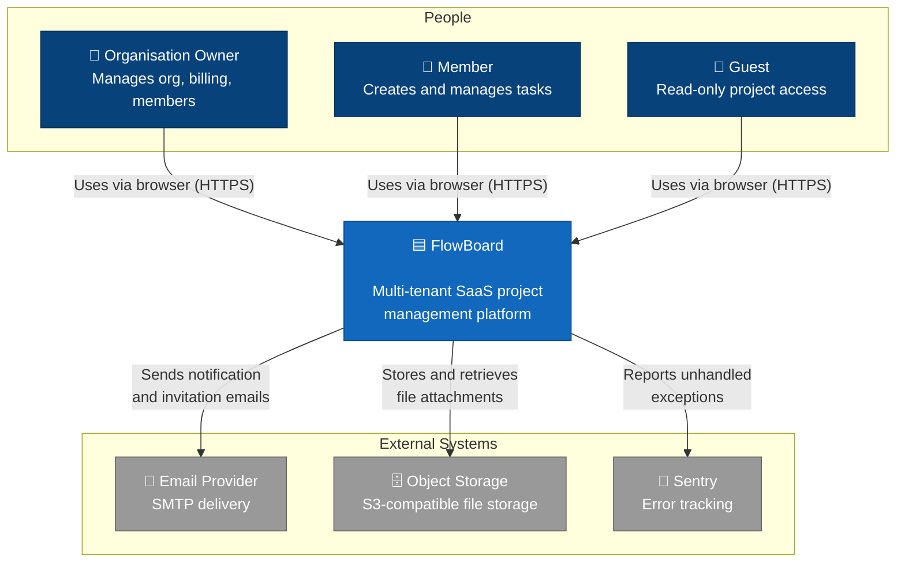

---

## 2. Container Diagram (C4 Level 2)

Shows the high-level technology building blocks and how they communicate.

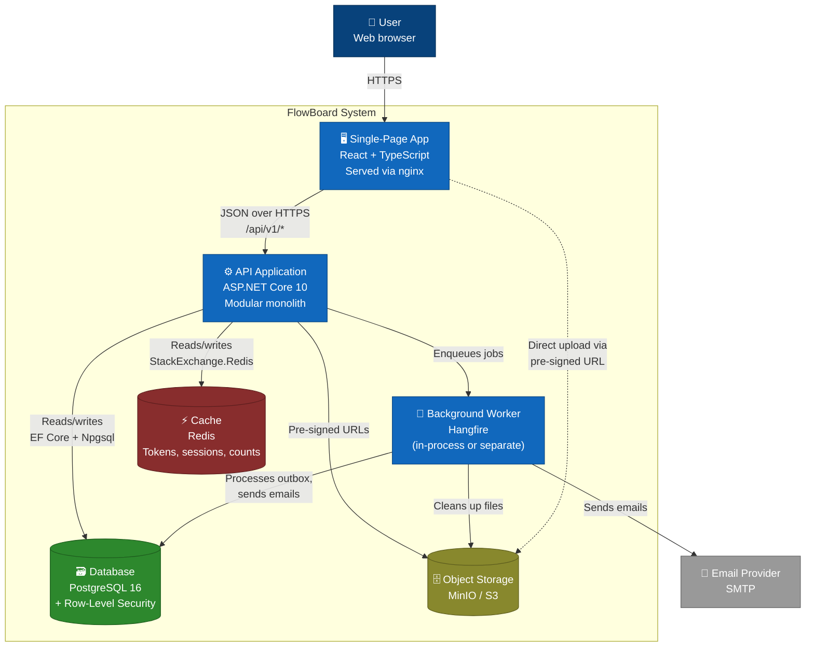

---

## 3. Component Diagram (C4 Level 3): Modular Monolith Internals

Shows the bounded contexts within the API and how they relate. Modules never
reference each other directly, they communicate only via domain events through
the outbox and the shared kernel.

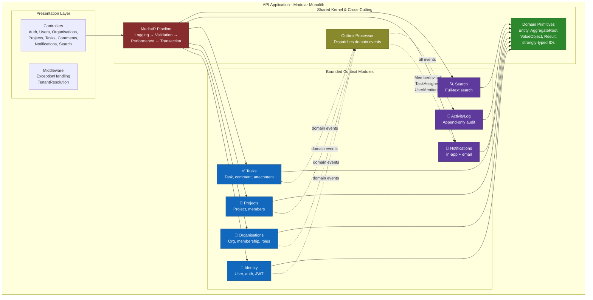

---

## 4. Clean Architecture Layer Dependencies

The dependency rule: arrows point inward. Inner layers know nothing about outer
layers. This is enforced by the architecture tests.

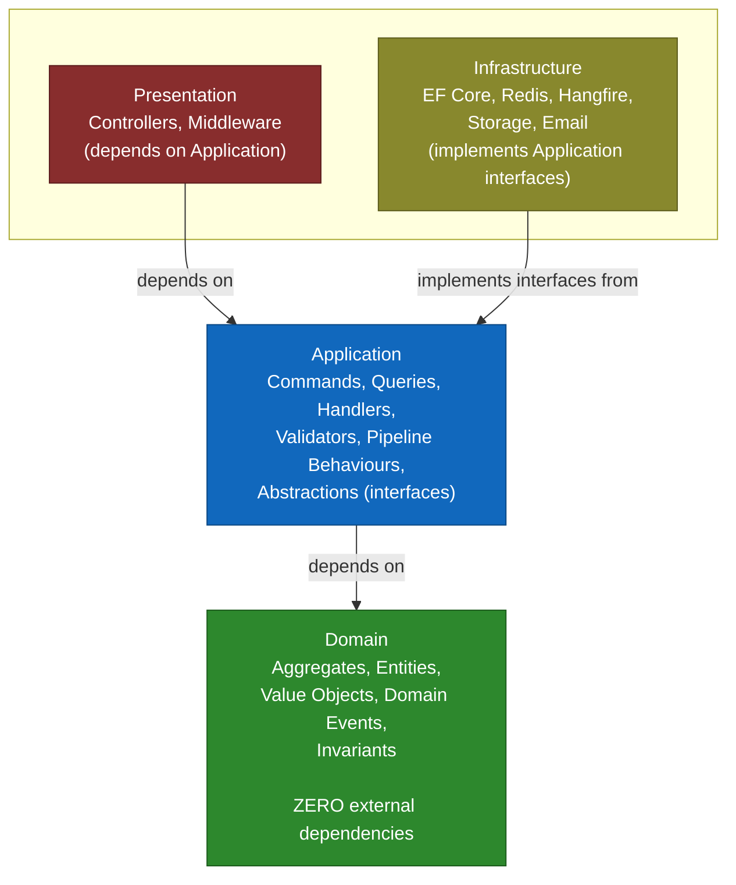

---

## 5. Sequence Diagram: User Login Flow

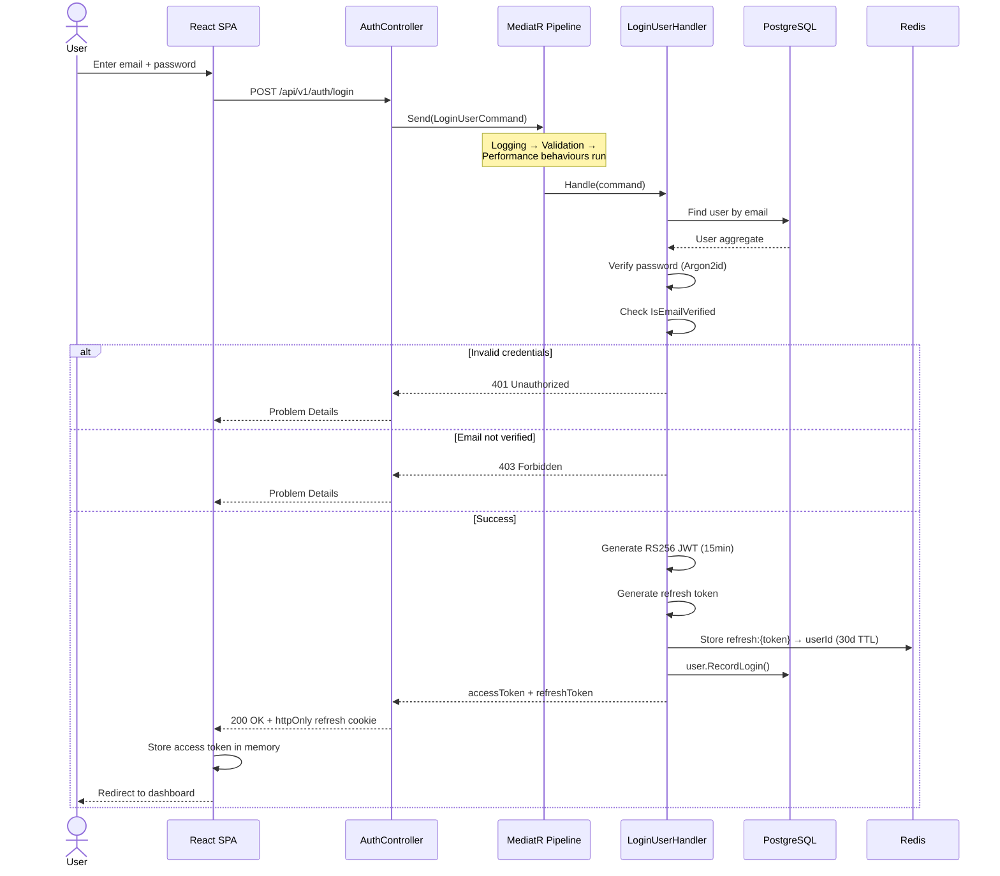

---

## 6. Sequence Diagram: Create Task with Outbox & Notification

This shows the full Transactional Outbox Pattern: the command, the transaction,
the outbox write, and the asynchronous event dispatch that creates a notification.

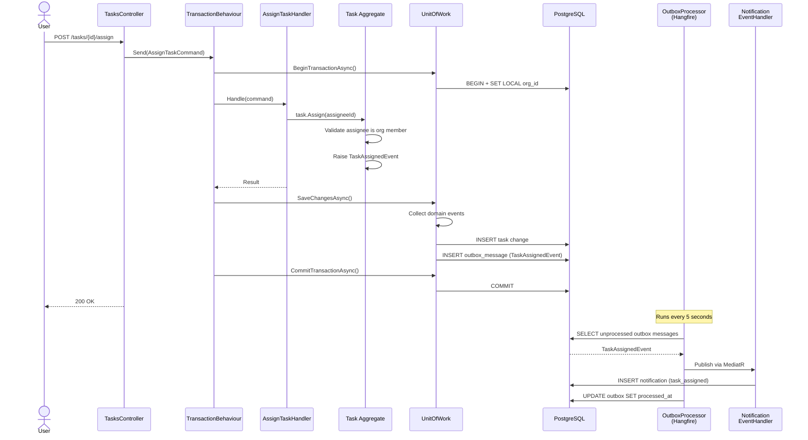

---

## 7. Sequence Diagram: File Attachment Upload (Pre-Signed URL)

No file bytes pass through the API server.

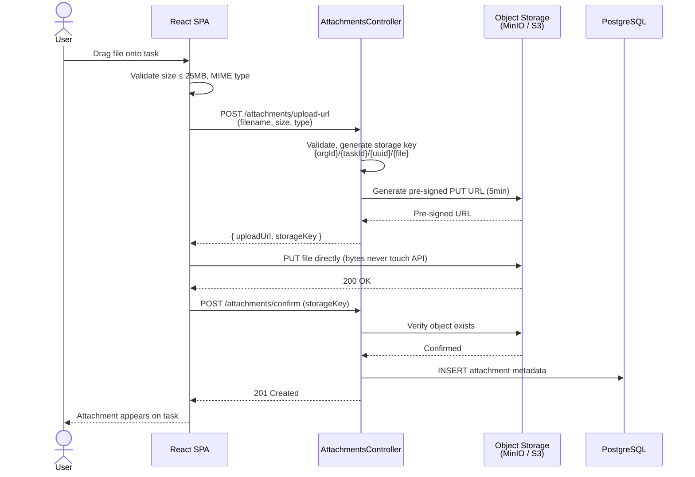

---

## 8. Entity Relationship Diagram

The full database schema. Append-only tables (`activity_logs`, `outbox_messages`)
have no soft-delete or update columns by design.

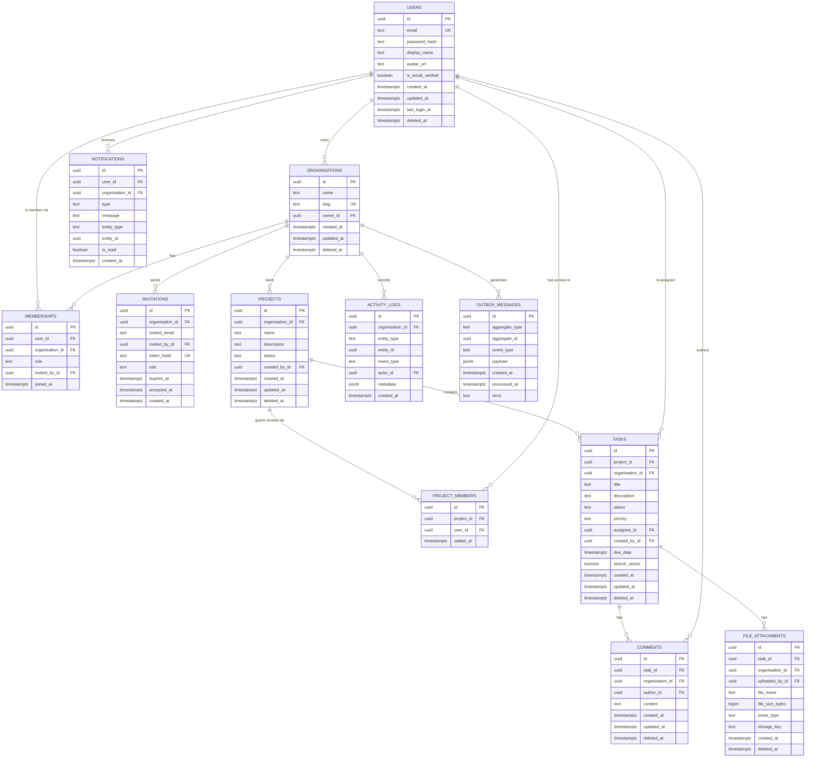

---

## 9. Aggregate Boundaries

Shows which entities belong to which aggregate. The aggregate root is the only
entry point; child entities are accessed only through the root.

```mermaid
graph TB
    subgraph identity_bc[Identity Bounded Context]
        user_agg["🟢 User (Aggregate Root)<br/>+ Email, HashedPassword,<br/>DisplayName (value objects)"]
    end

    subgraph orgs_bc[Organisations Bounded Context]
        org_agg["🟢 Organisation (Aggregate Root)"]
        membership["🔵 Membership (child entity)"]
        invitation["🔵 Invitation (child entity)"]
        org_agg --> membership
        org_agg --> invitation
    end

    subgraph projects_bc[Projects Bounded Context]
        project_agg["🟢 Project (Aggregate Root)<br/>+ MemberIds (references)"]
    end

    subgraph tasks_bc[Tasks Bounded Context]
        task_agg["🟢 Task (Aggregate Root)"]
        comment["🔵 Comment (child entity)"]
        attachment["🔵 Attachment (child entity)"]
        task_agg --> comment
        task_agg --> attachment
    end

    subgraph notif_bc[Notifications Bounded Context]
        notif_agg["🟢 Notification (Aggregate Root)"]
    end

    subgraph activity_bc[ActivityLog Bounded Context]
        activity_entry["🟡 ActivityLogEntry<br/>(append-only, no aggregate)"]
    end

    style user_agg fill:#2d882d,stroke:#1d5c1d,color:#fff
    style org_agg fill:#2d882d,stroke:#1d5c1d,color:#fff
    style project_agg fill:#2d882d,stroke:#1d5c1d,color:#fff
    style task_agg fill:#2d882d,stroke:#1d5c1d,color:#fff
    style notif_agg fill:#2d882d,stroke:#1d5c1d,color:#fff
    style membership fill:#1168bd,stroke:#0b4884,color:#fff
    style invitation fill:#1168bd,stroke:#0b4884,color:#fff
    style comment fill:#1168bd,stroke:#0b4884,color:#fff
    style attachment fill:#1168bd,stroke:#0b4884,color:#fff
    style activity_entry fill:#88882d,stroke:#5c5c1d,color:#fff
```

---

## 10. MediatR Request Pipeline

Every command and query flows through this pipeline before reaching its handler.

```mermaid
graph LR
    request["Request<br/>(Command or Query)"]
    logging["LoggingBehaviour<br/>Log entry/exit + duration"]
    validation["ValidationBehaviour<br/>Run FluentValidation<br/>→ 422 on failure"]
    performance["PerformanceBehaviour<br/>Warn if > 500ms"]
    transaction["TransactionBehaviour<br/>Commands only:<br/>Begin → Commit/Rollback"]
    handler["Handler<br/>Business logic"]

    request --> logging
    logging --> validation
    validation --> performance
    performance --> transaction
    transaction --> handler

    handler -.->|response| transaction
    transaction -.-> performance
    performance -.-> validation
    validation -.-> logging
    logging -.->|response| request

    style request fill:#08427b,stroke:#052e56,color:#fff
    style logging fill:#1168bd,stroke:#0b4884,color:#fff
    style validation fill:#1168bd,stroke:#0b4884,color:#fff
    style performance fill:#1168bd,stroke:#0b4884,color:#fff
    style transaction fill:#882d2d,stroke:#5c1d1d,color:#fff
    style handler fill:#2d882d,stroke:#1d5c1d,color:#fff
```

---

## 11. Multi-Tenancy Isolation (Three Layers)

How tenant data isolation is enforced at every level.

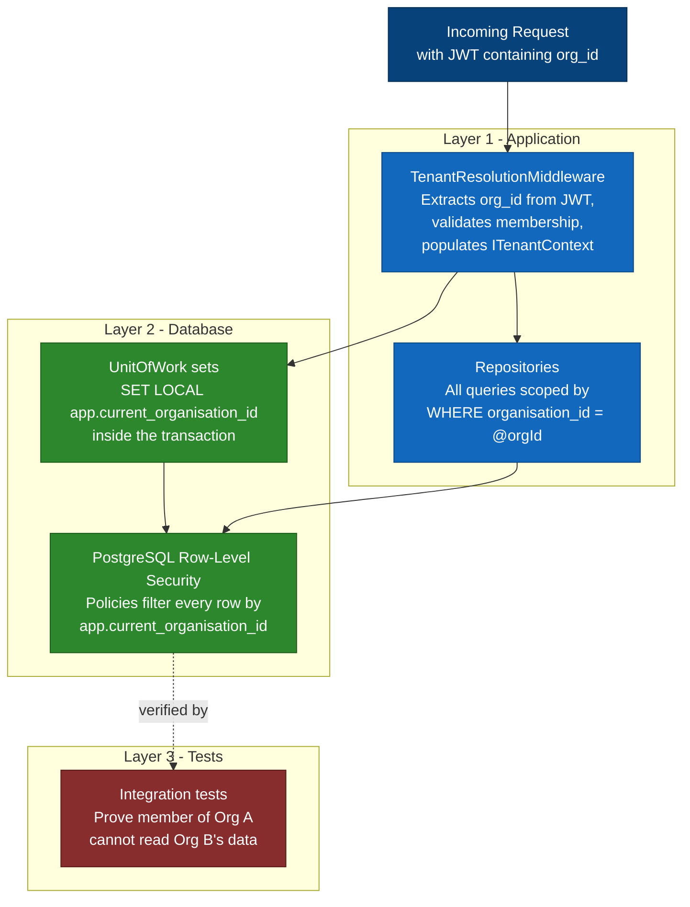

---

## 12. Deployment Diagram: Production

Production topology on a managed cloud provider (Railway / Render / Fly.io).

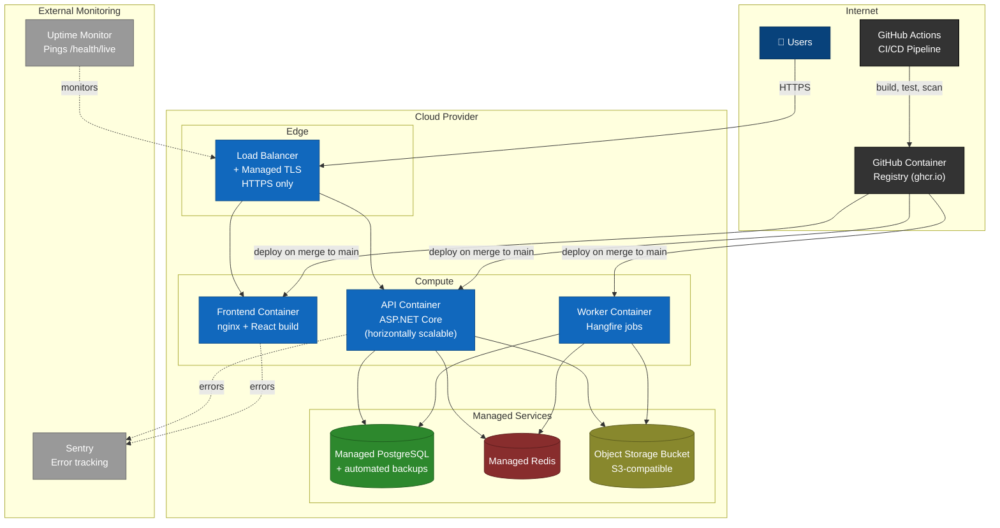

---

## Diagram Index

| # | Diagram | C4 Level | Purpose |
|---|---|---|---|
| 1 | System Context | L1 | FlowBoard and external actors |
| 2 | Container | L2 | Technology building blocks |
| 3 | Component | L3 | Modular monolith internals |
| 4 | Clean Architecture Layers |, | Dependency rule |
| 5 | Sequence, Login |, | Authentication flow |
| 6 | Sequence, Create Task + Outbox |, | Transactional outbox pattern |
| 7 | Sequence, File Upload |, | Pre-signed URL flow |
| 8 | Entity Relationship |, | Full database schema |
| 9 | Aggregate Boundaries |, | DDD aggregate design |
| 10 | MediatR Pipeline |, | Request processing |
| 11 | Multi-Tenancy Isolation |, | Three-layer tenant security |
| 12 | Deployment |, | Production cloud topology |
