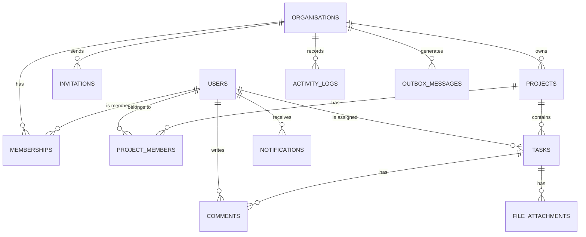

# FlowBoard: Domain Model

## 1. Overview

This document defines the domain model for FlowBoard using Domain-Driven Design (DDD)
concepts: aggregate roots, entities, value objects, domain events, and invariants.

The domain is divided into six bounded contexts. Each context owns its aggregates and
communicates with other contexts only through domain events.

---

## 2. Shared Kernel

Types shared across all bounded contexts. Defined in `FlowBoard.Domain/Shared/`.

### Strongly-Typed IDs

All entity identifiers are strongly typed to prevent accidental ID misuse across aggregates:

```csharp
public readonly record struct UserId(Guid Value);
public readonly record struct OrganisationId(Guid Value);
public readonly record struct ProjectId(Guid Value);
public readonly record struct TaskId(Guid Value);
public readonly record struct CommentId(Guid Value);
public readonly record struct NotificationId(Guid Value);
```

### Base Types

```csharp
// All entities have an Id and track creation time
public abstract class Entity<TId>
{
    public TId Id { get; protected set; }
    public DateTime CreatedAt { get; protected set; }
}

// Aggregate roots additionally own domain events
public abstract class AggregateRoot<TId> : Entity<TId>
{
    private readonly List<IDomainEvent> _domainEvents = new();
    public IReadOnlyList<IDomainEvent> DomainEvents => _domainEvents.AsReadOnly();
    protected void Raise(IDomainEvent domainEvent) => _domainEvents.Add(domainEvent);
    public void ClearDomainEvents() => _domainEvents.Clear();
}

// Value objects use structural equality
public abstract class ValueObject
{
    protected abstract IEnumerable<object> GetEqualityComponents();
    // Equals / GetHashCode implemented from components
}

// Result pattern, no exceptions for expected failure paths
public class Result<T>
{
    public bool IsSuccess { get; }
    public T? Value { get; }
    public Error? Error { get; }
    public static Result<T> Success(T value) => ...;
    public static Result<T> Failure(Error error) => ...;
}
```

---

## 3. Bounded Context: Identity

**Aggregate Root: `User`**

The `User` aggregate is responsible for its own lifecycle: registration, email
verification, password management, and profile updates.

### Value Objects

**`Email`**
```
- Validates format on construction
- Normalised to lowercase
- Equality is case-insensitive
```

**`HashedPassword`**
```
- Wraps an already-computed Argon2id hash string
- Static factory: HashedPassword.FromHash(encodedHash) → HashedPassword
- Performs no hashing or verification itself, those are the responsibility of
  IPasswordHasher (interface in Identity.Domain.Abstractions, implemented by
  Argon2PasswordHasher in Identity.Infrastructure), keeping the domain free of any
  cryptographic library dependency
- Never exposes the raw hash outside the aggregate
```

**`DisplayName`**
```
- 1-100 characters
- Trimmed of leading/trailing whitespace
```

### Aggregate: `User`

```
User
├── Id: UserId
├── Email: Email                    (value object)
├── Password: HashedPassword        (value object)
├── DisplayName: DisplayName        (value object)
├── AvatarUrl: Uri?
├── IsEmailVerified: bool
├── CreatedAt: DateTime
├── UpdatedAt: DateTime
├── LastLoginAt: DateTime?
└── DeletedAt: DateTime?            (soft delete)
```

**Behaviours:**
- `Register(email, hashedPassword, displayName)` → raises `UserRegisteredEvent`
  (the password is hashed by `IPasswordHasher` in the Application layer before being
  passed in; the aggregate receives a `HashedPassword`, never plaintext)
- `VerifyEmail(token)` → raises `EmailVerifiedEvent`
- `ChangePassword(newHashedPassword)` → raises `PasswordChangedEvent`
- `UpdateProfile(displayName, avatarUrl)`
- `RecordLogin()` → updates `LastLoginAt`
- `RequestPasswordReset(...)` → raises `PasswordResetRequestedEvent`
- `Delete()` → raises `UserDeletedEvent` (triggers anonymisation) — **planned, not yet implemented (as of Sprint 6)**

**Invariants:**
- A `User` cannot log in until `IsEmailVerified` is `true`
- Password minimum-strength rules are enforced on the plaintext by the command
  validator in the Application layer, before hashing

### Domain Events

| Event | Payload |
|---|---|
| `UserRegisteredEvent` | `UserId`, `Email` |
| `EmailVerifiedEvent` | `UserId` |
| `PasswordChangedEvent` | `UserId` |
| `PasswordResetRequestedEvent` | `UserId` |
| `UserDeletedEvent` | `UserId` — **planned, not yet implemented** |

---

## 4. Bounded Context: Organisations

**Aggregate Root: `Organisation`**

The `Organisation` aggregate enforces all membership and invitation rules. Membership
is an entity *owned by* the Organisation aggregate, it is never accessed directly
from outside without going through the aggregate root.

### Value Objects

**`OrganisationName`**
```
- 2-100 characters
- Trimmed whitespace
```

**`OrganisationSlug`**
```
- URL-safe slug derived from name
- Unique across all organisations
- Lowercase alphanumeric + hyphens only
```

**`MemberRole`**
```
Enumeration: Owner | Admin | Member | Guest
- Defines an ordering (Owner > Admin > Member > Guest)
- IsAtLeast(role): bool
```

### Entities within Aggregate

**`Membership`** (entity, child of `Organisation`)
```
├── Id: MembershipId
├── UserId: UserId
├── OrganisationId: OrganisationId
├── Role: MemberRole
├── InvitedById: UserId?
└── JoinedAt: DateTime
```

**`Invitation`** (entity, child of `Organisation`)
```
├── Id: InvitationId
├── OrganisationId: OrganisationId
├── InvitedEmail: Email
├── InvitedById: UserId
├── Token: string               (random, hashed before storing)
├── Role: MemberRole
├── ExpiresAt: DateTime         (CreatedAt + 48 hours)
└── AcceptedAt: DateTime?
```

### Aggregate: `Organisation`

```
Organisation
├── Id: OrganisationId
├── Name: OrganisationName
├── Slug: OrganisationSlug
├── OwnerId: UserId
├── Memberships: IReadOnlyList<Membership>
├── Invitations: IReadOnlyList<Invitation>
├── CreatedAt: DateTime
├── UpdatedAt: DateTime
└── DeletedAt: DateTime?
```

**Behaviours:**
- `Create(name, ownerId)` → adds Owner membership, raises `OrganisationCreatedEvent`
- `InviteMember(email, role, invitedById)` → raises `MemberInvitedEvent`
- `AcceptInvitation(token, userId)` → adds Membership, raises `MemberJoinedEvent`
- `RemoveMember(userId, removedById)` → raises `MemberRemovedEvent`
- `ChangeMemberRole(userId, newRole, changedById)` → raises `MemberRoleChangedEvent`
- `TransferOwnership(newOwnerId, currentOwnerId)` → raises `OwnershipTransferredEvent`
- `Rename(name)`
- `Delete(deletedById)` → raises `OrganisationDeletedEvent`

**Invariants:**
- `Organisation` must always have **exactly one** member with `Role = Owner`
- `TransferOwnership` is the only operation that changes the Owner role
- A user cannot be invited if they are already an active member
- An invitation cannot be created for an already-expired or already-accepted token
- A member's role may only be changed by someone with a higher-ranked role
- The Owner cannot be removed, ownership must be transferred first
- An `InvitedBy` user must be a member with `Admin` or `Owner` role

### Domain Events

| Event | Payload |
|---|---|
| `OrganisationCreatedEvent` | `OrganisationId`, `OwnerId` |
| `MemberInvitedEvent` | `OrganisationId`, `InvitedEmail`, `InvitedById`, `Role` |
| `MemberJoinedEvent` | `OrganisationId`, `UserId`, `Role` |
| `MemberRemovedEvent` | `OrganisationId`, `UserId`, `RemovedById` |
| `MemberRoleChangedEvent` | `OrganisationId`, `UserId`, `OldRole`, `NewRole` |
| `OwnershipTransferredEvent` | `OrganisationId`, `FromUserId`, `ToUserId` |
| `OrganisationDeletedEvent` | `OrganisationId` |

---

## 5. Bounded Context: Projects

**Aggregate Root: `Project`**

### Value Objects

**`ProjectStatus`**
```
Enumeration: Active | Archived
```

**`ProjectName`**
```
- 1-150 characters
```

### Aggregate: `Project`

```
Project
├── Id: ProjectId
├── OrganisationId: OrganisationId
├── Name: ProjectName
├── Description: string?
├── Status: ProjectStatus
├── CreatedById: UserId
├── Members: IReadOnlyList<ProjectMember>  (owned child entities: UserId, ProjectId, AddedAt)
├── CreatedAt: DateTime
├── UpdatedAt: DateTime
└── DeletedAt: DateTime?
```

**Behaviours:**
- `Create(name, description, organisationId, createdById)` → raises `ProjectCreatedEvent`
- `Update(name, description)`
- `Archive(archivedById)` → raises `ProjectArchivedEvent`
- `Restore(restoredById)` → raises `ProjectRestoredEvent`
- `AddMember(userId)` → raises `ProjectMemberAddedEvent`
- `RemoveMember(userId)`
- `Delete(deletedById)` → raises `ProjectDeletedEvent`

**Invariants:**
- An archived project cannot be edited (tasks and comments also become read-only)
- `CreatedById` user must be a member of the organisation
- A `Project` belongs to exactly one `Organisation` and this never changes

### Domain Events

| Event | Payload |
|---|---|
| `ProjectCreatedEvent` | `ProjectId`, `OrganisationId`, `CreatedById` |
| `ProjectArchivedEvent` | `ProjectId`, `OrganisationId`, `ArchivedById` |
| `ProjectRestoredEvent` | `ProjectId`, `OrganisationId` |
| `ProjectDeletedEvent` | `ProjectId`, `OrganisationId` |

---

## 6. Bounded Context: Tasks

**Aggregate Root: `TaskItem`**

> Naming note: the C# aggregate is named `TaskItem` and its status value object
> `TaskItemStatus`, to avoid colliding with `System.Threading.Tasks.Task` and
> `System.Threading.Tasks.TaskStatus` (imported via implicit usings across an async
> codebase). The database table remains `tasks`, the API routes remain `/tasks`, the
> strongly-typed identifier remains `TaskId`, and the domain event names are unchanged.
> The domain concept is still "task" throughout.

`TaskItem` is the richest aggregate in the domain. `Comment` and `Attachment` are entities
owned by the `TaskItem` aggregate, they have no meaning outside their parent task and are
never accessed independently.

### Value Objects

**`TaskItemStatus`**
```
Enumeration: Todo | InProgress | Blocked | Done
- Defines valid transitions (state machine):
    Todo       → InProgress, Blocked
    InProgress → Blocked, Done, Todo
    Blocked    → InProgress, Todo
    Done       → Todo (reopen)
```

**`Priority`**
```
Enumeration: Low | Medium | High | Critical
```

**`CommentContent`**
```
- 1-10,000 characters
- Preserved as-is (rendered as Markdown client-side)
- Extracts @mention handles on construction: Mentions: IReadOnlyList<string>
```

### Entities within Aggregate

**`Comment`**
```
├── Id: CommentId
├── TaskId: TaskId
├── OrganisationId: OrganisationId      (denormalised for tenant scoping)
├── AuthorId: UserId
├── Content: CommentContent             (value object, extracts mentions)
├── CreatedAt: DateTime
├── UpdatedAt: DateTime
└── DeletedAt: DateTime?
```

**`Attachment`** — **planned, not yet implemented (as of Sprint 6)**
```
├── Id: AttachmentId
├── TaskId: TaskId
├── OrganisationId: OrganisationId
├── UploadedById: UserId
├── FileName: string
├── FileSizeBytes: long
├── MimeType: string
├── StorageKey: string
├── CreatedAt: DateTime
└── DeletedAt: DateTime?
```

### Aggregate: `TaskItem`

```
TaskItem
├── Id: TaskId
├── ProjectId: ProjectId
├── OrganisationId: OrganisationId      (denormalised for tenant scoping)
├── Title: string                       (1-255 characters)
├── Description: string?
├── Status: TaskItemStatus              (value object with transitions)
├── Priority: Priority                  (value object)
├── AssigneeId: UserId?
├── CreatedById: UserId
├── DueDate: DateTime?
├── Comments: IReadOnlyList<Comment>
├── Attachments: IReadOnlyList<Attachment>   (planned, not yet implemented)
├── CreatedAt: DateTime
├── UpdatedAt: DateTime
└── DeletedAt: DateTime?
```

**Behaviours:**
- `Create(projectId, orgId, title, description, priority, createdById)` → raises `TaskCreatedEvent`
- `UpdateDetails(title, description, dueDate)`
- `ChangeStatus(newStatus, changedById)` → validates transition, raises `TaskStatusChangedEvent`
- `Assign(assigneeId, assignedById)` → raises `TaskAssignedEvent`
- `Unassign()` → raises `TaskUnassignedEvent`
- `ChangePriority(priority)` → raises `TaskPriorityChangedEvent`
- `AddComment(authorId, content)` → raises `CommentAddedEvent`, then one `UserMentionedEvent` per extracted @handle. Authorisation (author or Admin/Owner) for edit/delete is enforced at the application layer, not the aggregate.
- `EditComment(commentId, content)`
- `DeleteComment(commentId)`
- `AddAttachment(...)` / `RemoveAttachment(...)` — **planned, not yet implemented (as of Sprint 6)**
- `Delete(deletedById)` → raises `TaskDeletedEvent`

**Invariants:**
- `AssigneeId` must refer to a user who is a member of the task's organisation (enforced at the application layer before calling `Assign`)
- `ChangeStatus` must follow the defined state machine transitions, invalid transitions throw a domain exception
- A `Comment` may only be edited or deleted by its `AuthorId`, or by an Admin/Owner (role check at application layer)
- An `Attachment` may only be removed by its `UploadedById`, or by an Admin/Owner (planned, with attachments)
- A task in a soft-deleted project cannot be modified (enforced at the application layer)

### Domain Events

| Event | Payload |
|---|---|
| `TaskCreatedEvent` | `TaskId`, `ProjectId`, `OrganisationId`, `CreatedById` |
| `TaskAssignedEvent` | `TaskId`, `OrganisationId`, `AssigneeId`, `AssignedById` |
| `TaskUnassignedEvent` | `TaskId`, `OrganisationId`, `PreviousAssigneeId` |
| `TaskStatusChangedEvent` | `TaskId`, `OrganisationId`, `OldStatus`, `NewStatus`, `ChangedById` |
| `TaskPriorityChangedEvent` | `TaskId`, `OrganisationId`, `OldPriority`, `NewPriority` |
| `TaskDeletedEvent` | `TaskId`, `ProjectId`, `OrganisationId` |
| `CommentAddedEvent` | `CommentId`, `TaskId`, `OrganisationId`, `AuthorId`, `Mentions` |
| `UserMentionedEvent` | `CommentId`, `TaskId`, `OrganisationId`, `AuthorId`, `Handle` (raw @handle string; resolved to a user downstream) |

> Mention resolution: the `User` aggregate has no `Username` field yet, so a `@handle` is resolved
> against the **email local-part** of an organisation member (an ambiguous handle resolves to nobody).
> A dedicated username/handle is a planned follow-up.

---

## 7. Bounded Context: Notifications

**Aggregate Root: `Notification`**

### Value Objects

**`NotificationType`**
```
Enumeration:
  TaskAssigned | UserMentioned | ProjectInvited |
  TaskStatusChanged | CommentAdded | TaskBlocked
```

### Aggregate: `Notification`

```
Notification
├── Id: NotificationId
├── UserId: UserId
├── OrganisationId: OrganisationId
├── Type: NotificationType
├── Message: string
├── EntityType: string?          (e.g. "task", "project")
├── EntityId: Guid?
├── IsRead: bool
└── CreatedAt: DateTime
```

**Behaviours:**
- `Create(userId, orgId, type, message, entityType, entityId)`, factory method
- `MarkAsRead()`

**Invariants:**
- Notifications are never edited or deleted, they are marked as read
- A `Notification` always references a valid `UserId` within the same `OrganisationId`

---

## 8. Bounded Context: ActivityLog

The activity log is **append-only**. There is no aggregate root, `ActivityLogEntry`
is a plain entity that is only ever created, never modified or deleted.

```
ActivityLogEntry
├── Id: Guid
├── OrganisationId: OrganisationId
├── EntityType: string           (e.g. "Task", "Project", "Membership")
├── EntityId: Guid
├── EventType: string            (e.g. "task.assigned", "project.archived")
├── ActorId: UserId?             (null if system-generated)
├── Metadata: Dictionary<string, object>  (additional context stored as JSONB)
└── CreatedAt: DateTime          (immutable)
```

**Invariants:**
- `CreatedAt` is set once on construction and never changes
- No `UpdatedAt` or `DeletedAt` column exists on the backing table
- Records are never deleted (not even by the maintenance job)

---

## 9. Entity Relationship Diagram



---

## 10. Aggregate Summary

| Aggregate Root | Owned Entities | Bounded Context |
|---|---|---|
| `User` |, | Identity |
| `Organisation` | `Membership`, `Invitation` | Organisations |
| `Project` | `ProjectMember` (owned) | Projects |
| `TaskItem` | `Comment` (`Attachment` planned) | Tasks |
| `Notification` |, | Notifications |
| `ActivityLogEntry` |, (append-only, no aggregate) | ActivityLog |
